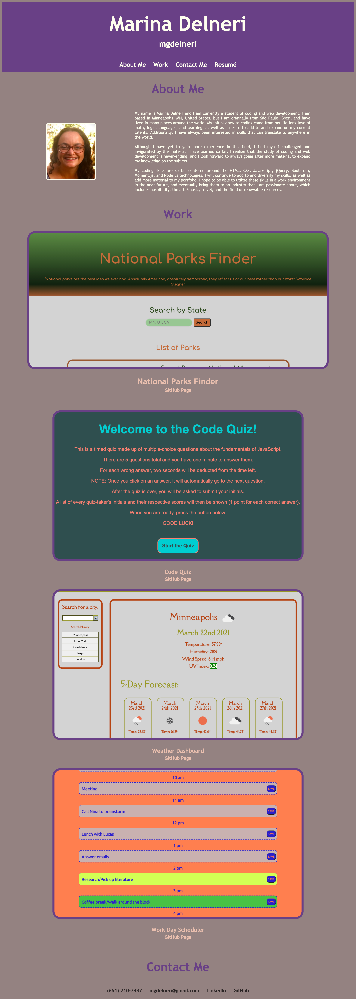

# MarinaDelneri-Portfolio

GOAL:

The goal of this project was to update my portfolio webpage as well as other professional materials. 

I went back to the portfolio I had already created a few weeks back, and we were assigned to add our group project and at least two other projects we created for our homework assignments. We were also supposed to update our GitHub profiles, making sure that we pinned repositories featuring our first group project and at least two other projects. The last two things we were supposed to update were our resume and LinkedIn profiles. 

Besides the initial specifications, the portfolio was to also have a link to a PDF version of the resume. Each project shown was to also have a link to the deployed live version of the webpage and a link to the GitHub page with that particular repository. 

This is an image of my updated portfolio:

Before going into the details of my process, I would like to point out that this portfolio is of course meant to be fluid and updated. My bio in the "After Me" section will also change as time goes on. 

PROCESS:

For this assignment, I first focused on updating the portfolio with new projects. I took images of all of the relevant projects and added them to my assets folder. I then made sure that all of the links worked correctly and went to the right webpages. I also changed the styling a little bit in CSS at this point, in order to accomodate the new images. 

The next step was to update my information in both my LinkedIn and GitHub portfolios. 

I then wrote out my resume, using a template from Career Services that is meant for beginner coders.

Lastly, I made sure everything was accessible through my portfolio. 

CONCLUSION:

At first, this assignment seemed pretty overwhelming, because there were a lot of unfamiliar professional materials to sift through and update. I quickly realized that nothing was going to seem complete or perfect. So I decided to tackle each one to the best of my ability, while also realizing that I will be continuously updating all of these materials. 

At the end, it felt useful to look at all of the pieces and tie them together in the portfolio. It also made it all seem less intimidating. It gave me a clearer idea of what is needed for a successful job search, as well as what I should focus on from here on out. 

Here is a link to the updated portfolio: 

https://mgdelneri.github.io/MarinaDelneri-Portfolio/

